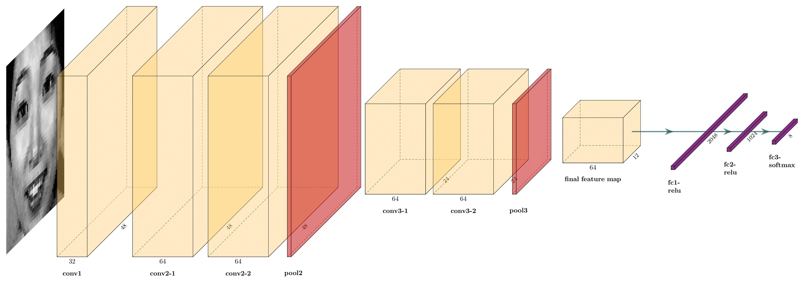
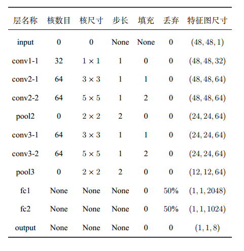
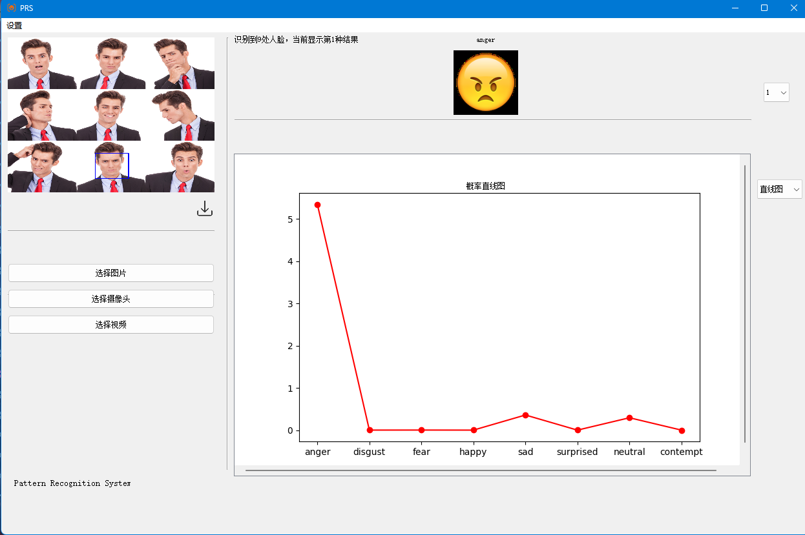

# 人脸表情识别

## 简介
使用卷积神经网络构建整个系统，在尝试了Gabor、LBP等传统人脸特征提取方式基础上，深度模型效果显著。
在FER2013、JAFFE和CK+三个表情识别数据集上进行模型评估。
遵守GNU 通用公共许可证（GNU General Public License，GPL）第三版的内容
### blazeface
人脸检测器

### UI

ui设计包，以及小部分工具包

### src简介
data.py 产生数据集，读取数据集
Gabor.py 利用Gabor滤波尝试实现,并在数据集FER2013、JAFFE和CK+上评估
LBP.py 使用LBP+SVM实现表情识别,并在数据集FER2013、JAFFE和CK+上评估
main.py 功能实现图片的表情识别
model.py 构建CNN模型（包括CNN1、CNN2、CNN3）
paper.py 绘制结果部分图像（工具包）
preprocess.py 用于图片预处理原图（添加噪声后、均值滤波后、中值滤波后、自适应中值滤波后、直方图均衡化、自适应直方图均衡化）
recognition.py 表情预测处理!
recognition_camera.py 利用摄像头实时检测
recognition_video.py 对视屏流的检测

test.py 图片测试
train.py 训练脚本
utils.py 工具包
visualize.py 可视化训练过程

## 环境部署
基于Python3.8和Keras2（TensorFlow后端）
```shell script
pip install cudatoolkit=10.1 -y
pip install cudnn=7.6.5 -y
pip install -r requirements.txt
```
如果你是Linux用户，直接执行根目录下的`env.sh`即可一键配置环境，执行命令为`bash env.sh`。

如果你是window用户，执行根目录下的'env.cmd' 即可配置conda环境

## 项目说明
### **传统方法**
- 数据预处理
	- 图片降噪
	- 人脸检测（HAAR分类器检测（opencv））
- 特征工程
	- 人脸特征提取
		- LBP
		- Gabor
- 分类器
	- SVM
### **深度方法**
- 人脸检测
	- HAAR分类器
	- MTCNN（效果更好）
- 卷积神经网络
  - 用于特征提取+分类


## 网络设计
使用经典的卷积神经网络，模型的构建主要参考2018年CVPR几篇论文以及谷歌的Going Deeper设计如下网络结构，
输入层后加入(1,1)卷积层增加非线性表示且模型层次较浅，参数较少（大量参数集中在全连接层）。



## 模型训练
主要在FER2013、JAFFE、CK+上进行训练，JAFFE给出的是半身图因此做了人脸检测。最后在FER2013上Pub Test和Pri Test均达到67%左右准确率
（该数据集爬虫采集存在标签错误、水印、动画图片等问题），JAFFE和CK+5折交叉验证均达到99%左右准确率（这两个数据集为实验室采集，较为准确标准）

执行下面的命令将在指定的数据集（fer2013或jaffe或ck+）上按照指定的batch_size训练指定的轮次。训练会生成对应的可视化训练过程，
下图为在三个数据集上训练过程的共同绘图。


```shell
python src/train.py --dataset fer2013 --epochs 300 --batch_size 32
```


## 模型应用
与传统方法相比，卷积神经网络表现更好，使用该模型构建识别系统，提供**GUI界面和摄像头实时检测**（摄像必须保证补光足够）。预测时对一张图片进行
水平翻转、偏转15度、平移等增广得到多个概率分布，将这些概率分布加权求和得到最后的概率分布，此时概率最大的作为标签（也就是使用了推理数据增强）。

### **GUI界面**

注意，**GUI界面提供缓存，切换下载默认目录，历史记录，下载，模型切换（需要在models目录添加其他识别模型），也可以通过下拉按钮查看该图片所有检测到的结果，同时提供实时视屏流预测，视频预测**

执行下面的命令即可打开GUI程序，该程序依赖PyQT设计，在一个测试图片（来源于网络）上进行测试效果。

```shell
python main.py
```

上图的main反馈的同时，会对图片上每个人脸进行检测并表情识别。


### **实时检测**
实时检测基于Opencv进行设计，旨在用摄像头对实时视频流进行预测，打开摄像头进行实时检测（ESC键退出），也可以指定视频进行进行检测。


